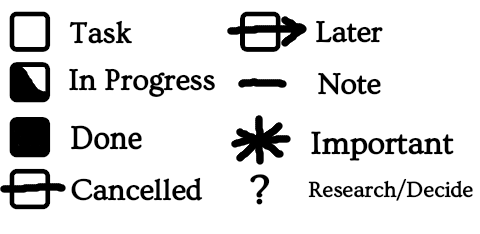

# THUNDERWARS

⚔️ THUNDERWARS: Personal Warfare Protocol

> Threat Habit Unmasking and Neutralization by Direct Engagement and Rigorous Willpower Against Ruinous Systems

> You Have Been Drafted.

**Version 0.24.0 dev**

---------------------------------

Begin by completing a BRANCH table, a FATIGUE DUTY chart, and a MESS HALL plan.

Then complete a DAGGER report for a zones within the BRANCH table identified as priority targets.

Maintain an INCIDENT LOG and GENERAL LOG.

Create Context Pages for frequently repeated tasks or significant future plans.

Review all checklists and procedures carefully, every time, do not just rely on memory.

## Design Principles

### Repeatability

Computers execute instructions the same way every time. Change the code, and the machine obeys just as reliably as before.

The human brain does not work that way[^11]. We forget. We make mistakes on tasks we’ve mastered. We may need weeks or months to learn or break a habit.

Checklists and procedures bridge this gap. They give us repeatability, making actions less dependent on memory or mood. 

They give us controllability, allowing us to reconfigure our future behavior as just by writing a few words on a page.

They make experimentation possible: we can test a new method today, and if it works, preserve it for tomorrow. 

They make new tasks approachable: what was once foreign becomes routine when we have a map to guide us.

And perhaps most importantly, they give us a contrast that reminds us of the limits. 

When a problem resists procedure, when something about it seems bigger than words can capture, we recognize it as a signal to adapt, improvise, or rethink — instead of stumbling blindly into hazard.

### Extreme Consistency

The system depends on an unwavering review rhythm — at minimum **Dawn**, **Dusk**, and **Weekly** (**SWORDPOINT**) reviews.

These reviews **cannot** be skipped or replaced by ad-hoc checks, even if you’ve already reviewed the same material earlier in the day.  

Redundancy is intentional — it builds reliability, strengthens habits, and prevents drift.  

Additional reviews may be done at any time (and often should be), but they are *supplementary*, never substitutes.  

**Why:** Consistency transforms the system from a collection of tools into an operational stance you can trust.

### Reachability

Borrowed from computer science — a document, reminder, or process is *reachable* if you can always get to it by starting from one of a small set of **root procedures** you already do, and can trust yourself to keep doing.

All important items must be **explicitly linked** to a "root" that you are confident you will review at the appropriate time, and they must be linked in a way that you are sure you will notice.

 **Roots** include:  

  - Your **General Log**  
  - **Context Pages**  
  - **Standard Reviews** (Dawn, Dusk, SWORDPOINT)  
  - **Essential physical tabs** in your Field Book
  - Timed electronic reminders

"Implementation Intentions" of the form "When X I will Y" are considered by some to be highly useful for replacing old
habits and forming new ones, but they do not guarantee the level of reachability needed for critical tasks.

Use them, but also be aware than anyone can just about anything at any time, and take measures to keep track of what matters.

No critical item should ever “float” without a path from a root — otherwise it becomes *unreachable* and effectively lost.

**Why:** This ensures nothing important disappears into the cracks, no matter how chaotic life gets.

### Do the Hardest Thing First

Most ordered steps are designed to get the most unpleasant task out of the way
first, unless there is some specific reason to do things in some other order.

This seems to be a popular approach with some productivity experts[^9], and has the objective
benefit of giving you an obvious, repeatable method for choosing what order to do tasks in,
which can sometimes be more stressful tuan actually doing the chores.

## CAPTURE DOCTRINE

Nothing important should exist entirely in your head. Document things immediately when you think of them,
so they are not forgotten.  

If something does not have an obvious place it should go, and can be expressed in a few words, 
put it in the GENERAL LOG.

Use shorthand, partial sentences, bullet points, etc, to reduce the friction of the initial capture step- you can
journal further later.

If something will take less than 2 minutes, just do it instead of recording it, unless there are multiple such things
on your mind at once, then record them to avoid forgetting them.

## CONTEXT pages

A context page[^8] contains checklist items and notes that should be referred to when doing a certain action or at a certain time.  We call them pages rather than lists, because in this system they are more than just task lists.

They can be used for recurring events, or for the planning leading up to one-time events.

They should usually be kept in the place where they will be used.

Frequently forgotten tasks should be added to the relevant CONTEXT page, even if it seems like you "should be able to remember them".

CONTEXT pages may also be a great place for motivational quotes, remembering that motivation is
not a substitute for discipline.

--------

## TODO List DOCTRINE

### Entry Rules

Be Specific & Actionable:
Write tasks as concrete actions, not vague goals.

Bad: “Work on storage room”

Good: “Clear top shelf of storage room”

#### Immediate Bias:
If a task can be done now (under 2 minutes), do it immediately rather than writing it down.

#### Short Form:
Keep entries brief (one short line). More detail goes in the context section if needed.

### Blocked/Before Items

Many tasks do not need to be done until another task is done or a specific event occurs.
While it is often beneficial to do tasks in advance, knowing what must be done immediately is still important.

When a task does not become relevant until a specific event happens, note it with a b., indicating 
"Blocks" or Before.

If you need ink to print a flyer, you might note the task as "Design Flyer b. ink"

It would likely be preferable to complete the task before the blocker, so you
have the option of getting started on the next step immediately.

This is not the same as adding a deadline to a task, because it does not denote when
the task needs to be done- it only indicates that the next step can't start until the blocker is
resolved.  

It is also not the same as a start time.  Nothing prevents you from completing the task now,
but it might not create value untill the blocker is resolved.

### Categorization

#### Immediate (General Log):

Tasks to be started within 24–48 hours can go in the General Log where they will be seen, at minimum, at dawn and dusk reviews.

#### Time-bound (Calendar / Context Page):

Tasks tied to a date, time, event, or location.

#### Deferred (Ideas / Someday List):

Non-critical, long-term, or “maybe” items can be moved to a separate list.

### 3. Motivation Attachment

For any task you suspect you might delay or avoid:

Write a Reason Statement — a short note explaining why this matters or the consequence of ignoring it.

Example:

Task: Replace worn boot laces

Reason: Prevents tripping at work — safety issue

Reason Statements are brief but emotional, linking the task to consequences or values, which has been shown in studies to increase success, and provide a starting point to understand the context.

### 4. Time Boxing

For certain tasks, replace the full completion goal with a time-limited session[^4] (e.g., “Spend 10 minutes on the bathroom”).

Use this especially when:

1. The scope is unclear or intimidating.
2. You expect it may take much less time than feared.
3. You can make meaningful progress in chunks.
4. You want to build a habit without initially overcommitting

-----------------------------------------------

## BRANCH table

> Battlefield Reconnaissance and Necessary Changes to Habits.

This is a unified chart of everything that's going on in the medium term, good or bad, that is bigger than just a simple to-do list entry.  It can contain big things, or smaller things, if you are attempting to analyze and reveal interconnectedness in a complex situation with many pieces.

If using paper, this system seems to work much better with sticky notes or cards rather
than just writing on paper. If handwriting, the title or name of every entry should be underlined or otherwise highlighted, without structure it can become confusing and hard to read.
 
Every entry should have:

### Keyword

BATTLE — Active, high-intensity problem or project.

CAMPAIGN — Planned multi-step initiative.

MYSTERY — Unknowns that need investigation, an active project primarily focused on a question.

DECREE — A policy or standing rule that you believe requires attention to integrate or maintain.

FRONTIER — New opportunity or expansion area.

ASSET — Resource to protect or maintain, that does not need major changes at the moment.

ALLIANCE — Relationship or collaboration.

### Timeframe(optional)

For minimal friction, use abbreviations. 1d, 1w, 1m, 1y, etc, for days, weeks, months, years.  Leave this blank if the time is unknown or ongoing.

###  Strategic Impact

 Why this matters to the realm overall. How it connects to long-term stability or growth, or what might happen if you fail in this area.

### Primary Challenge

The main obstacle or risk, not necessarily an “enemy strategy", although it may be.

### Strategy Outline

What are you going to do about this project?  What could make the task easier?
How will you stay motivated, and failing that, disciplined?   

Can an Implementation Intention[^1](If X, I will Y) be used as part of your strategy?

## DAGGER 

> Direct Action General Goal Elucidation Report

For long term, difficult, or confusing tasks, record the answers to any relevant questions on this list.

For smaller projects it may still be useful to review the list even if you do not decide to create a report.

### Core Questions

#### 🎯 MISSION OBJECTIVE

* What is your immediate goal?
* How will you know that you have at least succeeded in the short term?
* What is the timeline for this mission?
* Would some parts be better done later, made less extreme, or not done at all?
* Could any aspect of the goal or plan itself have been influenced or compromised by an enemy?

#### 💥 CONSEQUENCES

* What are you likely to lose if you fail this mission?
* What are you likely to gain if you succeed?
* How does this project align or not align with your values?

#### 🔥 OFFENSIVE STRATEGY

* What other tasks will be made possible or easier by completing the mission?
* What are the next actionable steps to completing the task?
* Can or should this project or desired new behavior be reinforced by attaching it to something you already do?
* Can this be scheduled for a specific time, or as a recurring event?
* What specific positive Implementation Intentions[^1] (When/If X, I will Y) can you form about this?
* How can the task be broken down into the smallest possible steps [^7]

#### 🛡 DEFENSIVE STRATEGY

* What physical, social, or procedural changes will make it easier to complete the mission?
* What will you no longer accept?
* What traps or hazards are likely active on this mission?
* What long term action is needed to maintain any ground gained?
* Do you have any conflicts of interest or motive for self sabotage regarding the mission?
* Are there unaddressed emotional or morale issues connected to this mission?
* Do you believe or feel that you deserve failure in this area?
* Is there a reason this has not been done already?
* Are any trivial or unimportant aspects of the project consuming more time and resources than they should be?
* What critical sections cannot be easily or safely paused?
* What items, skills, or people are most critical?
* What is most likely to go wrong?
* What decisions cannot be easily reversed?
* How will the physical environment affect this mission?
* How will time-related factors affect the mission?
* What aspects can be validated or confirmed with low time and resource commitment?
* What unproven assumptions do you have about the project?
* How should disruptive changes resulting from this mission be managed?

#### 🎒 SUPPLIES & SUPPORT

* What tools, reminders, or allies will you employ?
* Who do you need to coordinate with?

#### 🧪 TRAINING

* What knowledge, habits, or discipline must be improved?

### THREAT HABITS

If the mission relates to dismantling a THREAT HABIT, review these additional questions:

#### ☠️ CRIMES

* What has this enemy already taken from you?
* In what ways does this enemy cause you to betray your values?
* What false promises does this enemy make?
* What strategy does this enemy use to destroy you?
* At what times is this enemy typically active?

#### 🔨 JUSTICE

* How will you actively repair the damage that this habit has caused?
* What will you build that this enemy does not want you to?

#### 🕵️‍♂️ INTEL

* Is this habit serving a larger system that profits from your decay?
* What feedback loops or vicious cycles does this enemy create to preserve itself?
* Does this habit serve some purpose in your personal black market that you have not yet addressed?
* Does the habit serve some useful or necessary function that must be replaced with a healthier alternative?
* Did this habit serve some useful function at one time, which no longer applies?
  
### FIELD OPS

For specific, focused missions like preparing for an important meeting, use the additional FIELD OPS questions:

#### 🧠 PREPARATION
* Have you done a mental walkthrough of the full mission?
* Have you checked the weather report?
* Have you performed a dry run or test (e.g. equipment, presentation)?
* If you had to deploy right now, what would be missing?

#### ⚙️ GEAR
* Is all gear packed, charged, and weather-ready?
* Do you know what you will be wearing?
* Do you have all required medical, hygiene, or comfort items?
* Is all food and water accounted for?
* Do you need to gather documents, IDs, or permissions?
* Are any critical documents backed up on paper?
* Are digital files in the right formats, folders, and accessible offline?

#### 🚗 TRANSPORT & TIMING
* What is your departure time, and how was it calculated?
* Do you know exactly where to go, how to get there, and what door to enter?
* Is your arrival window realistic (traffic, parking, check-in)?
* Have you double-checked timezones, calendars, and alarms?
* When does the operation end, and how will you leave the site?

#### 🛠️ EXECUTION
* Will you have access to power, internet, and credentials?
* Will you be able to take breaks or eat if the op runs long?

#### 🗣️ COMMUNICATION
* How will you maintain contact with allies or support?
* Do you need to delegate anything or request backup?

#### 🧹 TEARDOWN & RECOVERY
* Have you planned to recover all gear or borrowed items?
* Is there a gear checklist for teardown?
* What needs to be cleaned, reset, logged, repacked, or uploaded?
* Have you madetime to rest, review, and debrief?

## DEBRIEF REPORT

(For reviewing missions, projects, and major events — victories or defeats)

Debrief reports may be done in a digital note, on the CONTEXT page used to olan the project,
or in the GENERAL LOG, and important things may be recorded in a BOOK OF LESSONS.

### Short Debrief 

(for quick wins or smaller events)

* What happened?
* What went well?
* What could have gone better?
* What's Next?

### Extended Debrief

(for major undertakings or failures worth deep study)

* What was the mission’s original goal?
* What changed along the way?
* What strengths or skills were proven?
* What mistakes or weak points were revealed?
* What resources proved critical?
* What was brought, purchased, or planned that was not needed or used?
* What unexpected allies or hindrances appeared?
* How can this be done better next time?
* What follow-up actions are needed now?
* What debts or wounds remain from this mission, and how will I make them right?

## SORTIE

> Stabilize, Orient, Regain, Target, Initiate, Endure

For unforseen problems, psychological ambushes, or emotional overwhelm.

### S — Stabilize

* Take a slow breath. Plant your feet. Feel one physical anchor point.
* Halt any harmful action before it gains momentum (e.g., lighting a cigarette, sending a rage message, self-sabotage).

### O — Orient

* Name where you are, who’s with you, and what’s actually happening right now.
* Name the evidence that currently shapes your understanding of what is happening. [^6]
* Is this threat or problem real, exaggerated, or imagined?
* Is your existing plan still viable?
* Quick-log any known tasks, duties, or follow-ups that could be lost in the chaos — so they’re safe to forget until later.

### R — Regain

* What are your core values? Which one can guide you here?
* What prior victories or moments of resilience can you recall right now?
* What capabilities and resources are available right now — including unconventional or “off-mission” ones?
* What can I avoid doing right now that will prevent making things worse?

### T — Target

* What is the root of the current problem or spiral — and what’s just noise?
* Document any actionable steps currently known and planned — even if incomplete.
* Prioritize: What must happen first? What can be delayed?

### I — Initiate

* Pick one action that gives you relief or traction (begin working on a known task, hydrate, walk, etc).
* Make it concrete and start within 60 seconds.[^7]

### E — Endure

* Continue working on tasks in priority order, even if some tasks are currently impossible.
* If there are blocking issues stopping the entire project, pick an some other productive task.

## Important Documents

### FATIGUE DUTY chart

For each regular and recurring task that must be performed, list:

* The action
* The likely consequences of failure to perform the action

Critical and time sensitive tasks should be tracked with an automatically repeating electronic reminder.

### MESS HALL

List any self care practices you intend to perform regularly as needed.

### LOGISTICS CHART

Record:
* Items that need to be purchased in the near future
* Items in need of repairs or unscheduled maintenance not listed in FATIGUE DUTY.
* Items or empty spaces that are notably currently not being used or that you intend to do something with

### GENERAL LOG

Record successful or unsuccessful completion of missions and all notable changing conditions, along with notes from the DAWN BRIEFING and DUSK WATCH

## The INCIDENT LOG 

> “Every blade I have drawn in folly, I sheath with care; every wound I have given, I seek to mend.”

The INCIDENT LOG exists to make mistakes a moment of learning and repair instead of shame or avoidance. The point is ownership and right-action, not punishment.

Process:

### 1. Spot the breach

When you realize you’ve failed to act in accordance with your values, goals, or standing orders, note it immediately in your Incident Log.

### 2. Name the harm

Who or what was affected, or could have been?Include both practical and moral impacts.

Avoid the “non-apology” trap — focus on your action, not how people reacted, or how "everything was fine in the end".

### 3. Repair if possible

If real harm was done, create a plan to make it right where you can. If you can’t repair, make a compensating action that still upholds your values.

### 4. Extract the lesson

Identify what tactical or strategic lapse caused it.

If a recurring problem is identified, it might go into your  “Banned Tactics”, or a refinement of your “Standing Orders.”

Identify and record:

* The time and date
* Contributing factors such as hunger or exhaustion
* What could have been done to prevent the error
* What could have been done to make the error impossible
* How the error could have been detected earlier

## The BOOK OF LESSONS

This document, which may be paper, or potentially digital as it involves long form, long term content,
is used to log what tou have learned from previous successes and failures.

It is separate from the incident log, and contains only events, both positive and negative, that you
believe have taught you some lasting important lesson.

It can contain debriefing notes from large projects, or things as simple as imternet "life hacks" you
believe you will actually use.

If paper is used, it might be best to use a separate notebook for this.

Entries should include:

* The time this lesson was gained
* The specific situation that occurred, or a general description of multiple events
* The specific mistake or success
* Key Lesson (Principle): Distilled into a general truth — no project jargon.
* Application (Where Else): List at least 2 other areas where this could matter.
* What change you made, or will make based on this information.

## 🌅 DAWN BRIEFING

> You Have Been Drafted

Conduct this review around breakfast or before you begin your day’s first duties.

Your DAWN BRIEFING NOTES should be entered into the GENERAL LOG.

### Inspection
1. Brief Sweep of the Physical Environment

### Review
1. Review your OPERATING STANCE
2. Review DAWN CONTEXT PAGE
3. What obligations, meetings, or events are there today?
4. What missions are underway?
5. Take a quick glance at your BRANCH chart
6. What’s the next actionable step for each?
7. Review any calendars or todo lists you keep.
8. Review Recent GENERAL LOG notes
9. Review FATIGUE DUTY Chart
10. Review MESS HALL: What morale, nutrition, or recovery actions are needed?

### Planning 
1. Record Today’s Intentions. Consult BRANCH if in any doubt.
2. Expected Hazards and Traps: What might go wrong? What ambushes are likely?

> Standby.... Ready..... GO!

### 🛡️ STANDING ORDERS & OPERATING STANCE

  For the duration of the day's mission, you should remember:
  
  * Perform tasks with conscious attention to your environment.
  * Use checklists and procedures carefully, don't just rely on memory
  * Pause frequently to recall today’s mission intent.
  * Don’t take shortcuts or deviate from procedure without clear cause.
  * Slow is smooth, smooth is fast—do not skip small actions like removing trip hazards to “save time.”
  * You remain on duty during idle moments (e.g. waiting for water to boil). Use them wisely. Maintain awareness.
  * If you aren't sure what you should be doing, go back and review the documents
  * Stop and reassesses if even minor non-ideal conditions are noticed
  * Don't leave tasks half-completed, put things away when done
  * Do things consistently-Avoid things that resemble unwanted actions or build incorrect muscle memory
  * Do things right away, or make a note to do things, as soon as you notice them

## 🌇 DUSK WATCH

Conduct this after most work is done, but at least two hours before you disengage from the day. This is your final command meeting.

### Inspection and Harbor Stow
1. Make Another sweep of the environment:
2. Doors locked, tools powered down, hazards cleared?
3. Devices charged, gear cleaned or stowed?
4. Supplies checked, groceries listed, repairs noted?
5. Half-completed tasks: Is there laundry in the washer? Has anything been started but not completed?

### Review
1. Review FATIGUE DUTY
2. Review the DUSK WATCH CONTEXT PAGE
3. Review recent GENERAL LOG entries
4. Review your BRANCH table and any relevant DAGGER charts

### Debrief
1. Record new events in the INCIDENT LOG and GENERAL LOG.  Try to log at least one notable event.

### Preparation
1. Set all needed alarms, alerts, and reminders
2. Record any known tasks and intentions for tomorrow
3. Ensure that any items or clothes needed tomorrow are ready to go
4. Review the MESS HALL document and consider taking self care actions

> All posts accounted for. Patrols stood down. Perimeter secure.

## Design Rationale for Daily reviews

In keeping with Do The Hardest Thing First[^9], we start with the physical sweeps, things 
that are likely to involve deciphering handwriting, and things that may be tedious due to length.

Another advantage is that the sweep can be done from memory(and then confirmed once you actually start the checklist!) without even picking up a book or phone, leaving hands free to do any ten second taks a discovered.

We want to keep recording intentions last, to avoid unnecessary akwardness with picking up and putting down pens.

This also allows one to immediately get started on things as soon as they write them down.

Due to the peak-end rule[^10], we expect a better percieved experience if easier or more pleasant things are kept near the end.

## ⚔️ Weekly Commander's Review: SWORDPOINT

> Strategic Weekly Overview, Debriefing, Planning, and Operational INTelligence

A high-command strategy debrief for the week’s campaign.  Probably best done on Saturday or Sunday.

> Remember that You Have Been Drafted.  Ignoring important missions is likely not a good option.

---

### INSPECTION
* Perform an in-depth sweep of your environment, looking behind, under, and inside things.

### 📚 DOCUMENT REVIEW

* Review the SWORDPOINT CONTEXT PAGE
* Review your other CONTEXT PAGES including infrequently used ones.
* Review the THUNDERWARS cheat sheet.
* Do any Standing Orders need review or reinforcement?
* Should your FATIGUE DUTY or MESS HALL charts be adjusted?
* Review LOGISTICS
* Transcribe anything that needs to be transcribed to digital form.
* Do the bookkeeping: Copy or summarize notes to where they should be.
* Is anything in your documents no longer relevant, that should be crossed out, erased, or archived?

### 📆 MISSION RECAP

* What were your major actions, goals, or struggles this week? List any operations, breakthroughs, regressions, surprises, or pivots.
* Did anything from the week deserve a DAGGER report?

### 🧠 DEBRIEF

* What went well and why?
* What failed and why?
* Were there signs you ignored, shortcuts you regretted, or things that could’ve been anticipated?
* Are there emerging themes in your INCIDENT LOG?

### 🔥 DAMAGE REPORT

* What areas fell into chaos, neglect, or regression?
* What friction points or breakdowns repeated?
* Any untracked or creeping obligations forming?
* Any consistently neglected tasks?
* What RUINOUS SYSTEMS may be affecting you at present?
* Am I copying, taking on, or absorbing inappropriate attitudes, thoughts, or feelings from anywhere?

### Spycraft Check

#### Local World 

* Who near me usually knows what’s happening soon? Have I checked with them?
* What events, festivals, or meetups were mentioned in passing this week?
* What changes did I notice on my block, at local shops, or in the neighborhood? 
• What changes have I noticed with relatives, friends, or close contacts?

#### Mission Zone

* Did I hear of new deals, contracts, or clients that will shift focus?
* Who has ‘soft info’ (rumors, early signals) that could affect priorities?
* What problems did someone brush off with ‘not a big deal’? Could it be bigger?

#### Silent Signals

* Who seemed stressed, absent, or unusually quiet? Did I ask why?
* What’s missing from the usual flow of updates?
* Is there a policy or system I depend on that hasn’t been mentioned in a while?

#### Personal Connections

* Who haven’t I checked in with directly that I rely on for awareness?
* What one-on-one conversation could give me clarity that group channels won’t?

#### Actionable Steps

* What small question can I ask someone this week that could reveal hidden information?
* What intel do I need before the next decision point?

### Task Management
* What tasks are currently blocked on something else?
* What has recently become unblocked?
* If I am waiting on a question, what can I do now that will still be useful regardless of the answer?
* Is there sufficient slack time to handle unforseen events?

### 🛠️ STRATEGIC ADJUSTMENTS

* What do you want to change about your approach or posture next week?
* What unused resources, spaces, or abilities have you noticed that you could apply?
* Are you focusing too much on any specific strategies or tools, and potentially missing other possibilities?[^2]
* Are any small details either being ignored or consuming more time than they should be?[^3]

### 🎯 NEXT WEEK'S DIRECTIVES
* What are your key missions or events?
* What needs prep or early action now?
* Which actions are critical to retaining ground gained?

### LONG TERM ALIGNMENT
* What kind of person do you intend to become?
* Review your CHARTER OF THE REALM
* What "someday" projects would you like to eventually work on?
* What are your current top goals?
* What steps have you taken this week towards your goals?
* What obstacles have impeded progress towards them?
* What actions will you take towards them this week?
* Are your goals or actions related to them represented in your calendar, to-do list, general log, or other *reachable* documents?
* What aspects of your goals and projects can you pursue with focused deep work?

### 🧭 VALUES ALIGNMENT
* Are you moving closer to the kind of person you want to become?
* Are any goals losing connection to your values or drifting toward burnout?

### ✔️ TODO Review

1. Move anything non-urgent to the Ideas/Someday list.
2. Merge duplicates or related items into a single clear task.
3. Split large tasks into smaller, single-action steps.
4. Upgrade vague entries with a clearer action and/or Reason Statement.
5. Check off and record completed items in the GENERAL LOG

## The Training Grounds

These exercises can be done at any time.

### Willpower Sparring (Micro-Stress Tests)

Practice: deliberately choose 1–2 small discomforts daily (cold rinse, finishing boring chore, delaying a craving).

Benefit: builds tolerance to stress, inoculates against overload and avoidance.

### Situational Awareness Drills

* In a building you recently visited, where are the exits and bathrooms?
* What is above your head and near the floor? What is to the left and right? What is on your person?
* In the last place you were around people, who looked confident and who looked stressed or out of place?
* What can you infer about your environment from a small detail?
* What is missing in your environment that you would expect or want to be there?
* What is the likely cause of some small clue(a noise, smell, etc) and what is likely to follow from it?
* What two things have you noticed recently that did not match, and what could that mean?
* Take three random details from your day and find the story they imply

### Attention Tunneling Prevention Drills

#### One more around the bend

Whenever you notice a potential problem of any kind, try to think
of one more potential problem you haven't noticed.  The period 
just after mitigating the first one is dangerous, because it is
easy to forget that other less obvious problems exist.

Practice by thinking of some recent problems you have noticed,
and finding a matching paired issue in the same situation, ideally in a 
completely different category.  

If you found an empty soap dispenser, could anything else about the dispenser
be an issue?  If a stack of papers by the heater is a fire hazard, is there something
in those papers you forgot?

#### Interrupt Recovery 

Whenever you are interrupted for any reason, always ask what happened and what you were doing
before you were interrupted.

Practice by choosing three events and identifying what happened before them.

### Strategy Drills

* How would you have handled a recent challenge without the tool or method that you used?
* How would you have done a recent project with half the time or half the resources?
* If someone was trying to sabotage you right now, what would they do?

### 👁️ The Quiet Eye Discipline

Quiet Eye[^5] training is used in many seemingly unrelated fields, from sports to healthcare and law enforcement.

####  1. Fixed Gaze

> The warrior anchors their mind, and does not turn away from the fearsome sight

Practice: hold eyes steady on a single point (dot, mark, flame).

Purpose: lengthens focus, reduces wandering attention.

#### 2. Tracking

Practice: follow a moving object smoothly (pendulum, thrown ball, person walking).

Purpose: improves hand–eye coordination and predictive timing.

Analogy: shadowing an enemy’s blade, or a hawk tracking prey.

#### 3. Pre-Action Focus

> The archer makes sure of his aim before he fires

Practice: pause to fix your gaze on the critical spot before moving (foot placement before stepping, handle before grasping, text before writing).

Purpose: strengthens decision–action coupling; reduces clumsy errors.

#### 4. Peripheral Expansion

> The ranger knows the changing conditions of battle 

Practice: soften your focus and notice the whole scene — awareness of motion, shapes, colors at the edge of vision.

Purpose: prevents tunnel vision; increases situational awareness.

#### 5. Shift Control

> The good scout finds what is hidden and examines it closely 

Practice: deliberately switch between tight focus, as in Tracking or Fixed Gaze, and wide awareness.

Purpose: agility of attention; flexible mind under pressure.

### Time Awareness Drills 
> Polychronic Training for Monochronic Minds

#### Buffer Discipline Drill

Setup: Block 30–60 minutes in your planner but label it only as "flex time".

Rule: You cannot pre-plan it. When you reach it, you must choose what to do on the spot, avoiding any RUINOUS SYSTEM habits and unenjoyable "counterfiet liesure".

Difficulty upgrade: Roll a die or flip a coin to decide whether you use it for rest, socializing, or a small useful task.

#### Incomplete Information Drill

Setup: Pick a small project, like drawing a picture, with low stakes and low potential material waste, but forbid yourself from having all the details in advance or doing any research before physically starting.

Rule: Start anyway, filling in missing pieces as you go.

Goal: Reduce paralysis when plans aren’t fully clear.

#### Event-Based Timing Drill

Setup: Choose a non-critical task to schedule not by the clock, but by events (e.g., “after I eat,” “before the sun sets,” “once I’ve spoken to X”).

Note that this type of plan does *not* count as "reachability", at least not consistently for all people, and should not be intentionally relied on for
anything critical.

Rule: No exact times allowed, only relationships.

Goal: Loosen dependence on clock precision and learn to feel time in a more organic rhythm.

## FIELD BOOK

The "standard" form of paper version of this system uses Personal size pages, commonly (and incorrectly) known as A6.

### Standard Supplies 

### Personal Size 6 ring planner

### 0.9mm mechanical pencil
Preferably the Sakura Sumogrip or similar. 0.9 is chosen because it
is much more durable and reliable than 0.5 or 0.7, and is now widely available.

### 1.5x2" sticky notes

These smaller notes are perfect for things like the BRANCH table which may change
regularly, and can also be used to attach reminders to objects, although for many
people this should not be relied as they may go unnoticed.

### Tab Dividers

### Storage pouch page

This is important for keeping track of your sticky notes. 
Often included with planner kits.

### Today marker ruler
For quick access in the GENERAL LOG, often included with planner kits.

There should be 5 tabs:

### GENERAL LOG

Use a bookmark to quickly jump to the specific day.  Those who 
mostly use digital media can use this for short bullet point upgrades,
and keep a separate digital DIARY for longer discussion.

### OPERATIONS

This section deals with monitoring the state of ongoing projects.

Keep the BRANCH table at the front, and add any DAGGER reports after.

Keep CONTEXT PAGES here unless they have somewhere else specific to be.

### BASE CAMP

This section deals with normal everyday life, and routine tasks not otherwise associated with a specific mission.

* FATIGUE DUTY chart(Always in front)
* MESS HALL chart
* LOGISTICS page
* CONTEXT PAGES that don't have somewhere else to be

### MISC

For any random nonstandard notes

### INCIDENT LOG

This gets it's own section in the back, for quick access without imposing too much unpleasantness

### Symbols

## CHARTER OF THE REALM

To aid in prioritizing projects and goals, consider your thoughts on these matters, keeping in mind that you may have to discover them over time, and taking care not to lock yourself into an unhealthy self image.

### Core Values

> "These are the banners I ride beneath; I raise them high so I may see them clearly in the dust of battle."

Your moral compass, virtues you fight for

### Favored Arts

> "I hold these favored arts in trust, knowing they have served me well in times past. Yet I remain mindful that even the surest hand may falter.  Thus I pledge to wield my strengths with care, lest they endanger those I am sworn to protect."

Your "Core Competencies", bearing ever in mind that they may change.

### Standing Orders

> "When the horns sound and the fog of battle covers all, still the golden path shines clear."

Non-negotiable rules you always follow

### Victory Conditions

What “winning” in life means to you

### Banned Tactics

> "Some weapons I leave to rust"

Things you refuse to do, even if they might “work”

## RUINOUS SYSTEMS

You may want to create a separate page to list any larger threats that may be working in the background, as common factors driving multiple seemingly unrelated THREAT HABITS.

Use the THREAT ASSESSMENT QUESTIONS to analyze each one:

1. What behaviors does this system produce or reinforce?
2. Is there a core emotion it seems designed to manage (e.g. fear, shame, overwhelm)?
3. What beliefs or assumptions sustain it?
4. What cues or situations activate it?
5. Can or should these situations be modified to prevent this?
6. What social, material, or environmental factors sustain it?
7. What unmet need might this system be attempting to serve?
8. Has this pattern helped you survive something in the past?
9. What’s the minimum viable change to reduce its impact?
10. What is a healthier or more productive alternative to participating in this system?
11. How can friction be added so that it is harder to participate in the unwanted system?
12. How can friction be removed so that it is easier to engage in healthier alternatives?
13. Is this system self-reinforcing or part of a vicious cycle or feedback loop?
14. Is professional or deep personal work required here?

## Paper Vs. Digital DOCTRINE

One possible template for those primarily using digital media.

### Electronic (The Command Center)

#### Calendars & Critical Reminders

Use electronic tools for time-sensitive alerts, recurring events, and deadline tracking.

#### Deep Analysis & Long-Form Planning

Electronic is faster for typing, editing, and reorganizing complex thoughts.

#### On-the-Go References

Keep essential reference data in your phone/tablet unless a notebook is already in play for the day.

#### Sensitive or Emotional Material

Digital storage allows encryption or password protection, deterring casual snooping.

#### Long Term Storage

Digital data can be easily preserved, making it convenient for things like ideas/maybe lists.

### Paper (The Field Log)

#### Temporary, Low-Stakes Data

Quick jot notes, numbers, or sketches that lose relevance after hours/days.

#### Breaking Creative Blocks

Paper removes digital distractions and encourages nonlinear thinking.

#### First Impressions & Raw Observations

Physically writing something requires more effort, do the harder thing first if both paper and digital copies are needed.

#### Instant-Access Situations

Data you may need without load times (maps, quick reference tables, visual mnemonics, simple daily todos)

## 📦 ARCHIVE

### Step 1: Field Archive

When a page is no longer active but may still be referenced soon (e.g. last week’s BRANCH, recent gear logs, completed DAGGERs), move it to the rear of your FIELD BOOK, after your spare blank pages. This keeps it accessible, but out of your working tabs.

### Step 2: Deep Archive

When pages are fully complete or unlikely to be used again soon, transfer them to your archive box or binder at base. File by section or date for long-term reflection, incident tracking, or post-mission analysis.

“Leave no thought behind. Every battle fought teaches the next one.”

## Gear Discipline 

Excessive quantities of objects can consume large amounts of time and effort, sometimes starting before the item is even purchased!

### Mission-Driven Loadouts

Military principle: Every piece of gear must justify its weight by its direct connection to the mission.

Practice: Soldiers don’t just carry “what might be useful.” They’re trained to constantly evaluate whether an item supports the immediate mission, the environment, and the duration of action.

### Weight & Bulk Discipline

Soldiers are told: “Ounces make pounds, and pounds make pain”

Always pick up your loadout, put it on, and walk around before committing. 

If you wouldn’t want to sprint or climb with what you plan to carry, or if you dread loading and unloading it all, something has to go.

### Staging & Layering

Both militaries and first responders use layers when out in the field.

#### On-body (first line)

Absolute essentials (knife, water, ID, comms, light, etc). Must never leave your person.

#### Pack (second line)

Mission gear you might drop temporarily, but would recover soon.  This is the gear that is actively in use, or extremely likely to be used soon, such as the tools in a tool belt.

#### Base (third line): Bulk items left at camp/vehicle/rucksack/etc.

Civilians in non-emergency situations almost always have an additional "fourth layer" of things that can be readily bought, borrowed, ran home for, or otherwise found easily.

This makes many non-critical items less important than they seem to be.

For every item, determine what layer it belongs in, and how it should be securely carried.

### Post-Mission Review

After every op, soldiers do a “lessons learned” session: what was never touched? what saved the day? what broke?

During your debriefings, pay special attention to items that are consistently unused.

### Standardized Lists (But Flexible)

Units often use a baseline packing list (everyone carries X, Y, Z).

Civilian adaptation: Have a master list for camping, travel, work — but trim ruthlessly before each trip.

### Gear Care Discipline

Add any regular maintenance to a repeating calendar event, or to a CONTEXT page you use regularly, possibly even the SWORDPOINT page.

### Morale vs. Mission Gear

Military acknowledges morale is part of survival. A letter, a photo, or one comfort item is often encouraged — but not an entire pile.

### Mission Fit Questions

* What mission is this item supporting? (Daily living, work task, outdoor trip, emergency readiness, etc.)
* What happens if I don’t have it? (Real consequence vs. mild inconvenience.)
* Do I already own something that can substitute? (Multi-use tools usually beat single-use ones.)
* Is there an alternative that doesn't require any gear at all?
* Could I obtain this item at the last minute if I suddenly need it?
* How often will this be in play? (Daily, monthly, once a year, “only if everything goes wrong.”)
* Does it connect with my existing gear? (Does it strengthen a system of items I already use, or sit outside the strategy?)

### Burden Analysis

* Where will it live when not in use? (Does it have a home, or will it float around as clutter?)
* What does it cost to maintain? (Batteries, space, cleaning, updates, spares.)
* Does it require training or practice to be useful? (If so, will I realistically practice with it?)
* How will I feel every time I see it? (Does it motivate or demoralize?)
* Does the item support any THREAT HABITS I am trying to quit?
* Does the item require any special protection from damage or loss?
* Is there likely to be a better version out before I actually want or need to use the item?
* Does the item have limited shelf or calendar life? Will it be used before expiration?

### Imagination Drills

* Picture a day using it. How does it make life easier or safer?
* Picture a day carrying it but not using it. How much friction or regret does it add?
* Picture lending or losing it. Would I really care, or would I secretly be relieved it’s gone?
* If I could only bring 5 items on a mission, would this make the cut? Why?
* If this item didn’t exist, how would I solve the problem? (Sometimes the “workaround” is better than the object itself.)

## Administrative

### Typography
The official font is Ovo for body text, and Black Ops One for headings.

Headings level 1 and 2 should be centered, all lower level headings should 
be right-aligned.

### Semantic Versioning 

This project uses SemVer for version number.

## References

As this is not an academic paper, citations do not always follow standard practice for scientific writing,
they are there to provide historical context and starting points for further research.

[^1]: Wikipedia contributors, "Implementation intention," Wikipedia, The Free Encyclopedia, https://en.wikipedia.org/w/index.php?title=Implementation_intention&oldid=1309452985 (accessed September 9, 2025).

[^2]: The Book of Five Rings, https://en.wikipedia.org/w/index.php?title=The_Book_of_Five_Rings&oldid=1306221261 (last visited Sept. 9, 2025).

[^3]: Wikipedia contributors, "Law of triviality," Wikipedia, The Free Encyclopedia, https://en.wikipedia.org/w/index.php?title=Law_of_triviality&oldid=1307628790 (accessed September 9, 2025).

[^4]: Wikipedia contributors, "Timeboxing," Wikipedia, The Free Encyclopedia, https://en.wikipedia.org/w/index.php?title=Timeboxing&oldid=1294019433 (accessed September 9, 2025).

[^5]: Wikipedia contributors, "Quiet eye," Wikipedia, The Free Encyclopedia, https://en.wikipedia.org/w/index.php?title=Quiet_eye&oldid=1305803999 (accessed September 9, 2025).

[^6]: Wikipedia contributors, "Cognitive restructuring," Wikipedia, The Free Encyclopedia, https://en.wikipedia.org/w/index.php?title=Cognitive_restructuring&oldid=1291979046 (accessed September 9, 2025).

[^7]: Amabile, Teresa M., and Steve J. Kramer. The Progress Principle: Using Small Wins to Ignite Joy, Engagement, and Creativity at Work. Harvard Business Review Press, 2011

[^8]: Allen, David. 2002. Getting Things Done. London, England: Piatkus Books.

[^9]: Rachel Habbert and Juliana Schroeder, “To Build Efficacy, Eat the Frog First: People Misunderstand How the Difficulty-Ordering of Tasks Influences Efficacy,” Journal of Experimental Social Psychology 91 (2020): 104032. 

[^10]: Kahneman, Daniel; Fredrickson, Barbara L.; Schreiber, Charles A.; Redelmeier, Donald A. (1993). "When More Pain Is Preferred to Less: Adding a Better End". Psychological Science. 4 (6): 401–405. https://doi.org/10.1111%2Fj.1467-9280.1993.tb00589.x

[^11]: Gawande, Atul. The Checklist Manifesto. London: Profile Books, 2011.
